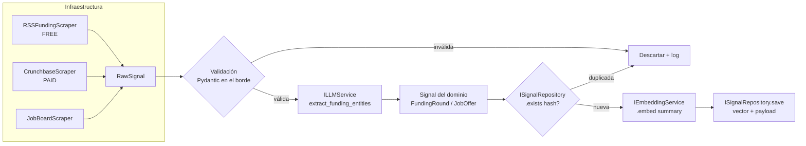
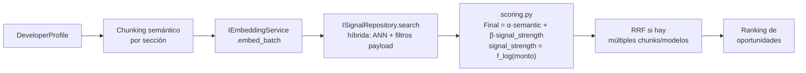
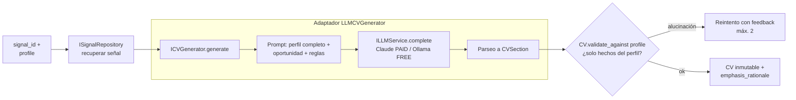

# ARCHITECTURE.md — VenturePulseAI

> Sistema de inteligencia de mercado laboral: recolecta señales (ofertas de trabajo y rondas de inversión), las vectoriza en Qdrant, y genera CVs personalizados adaptando el perfil del desarrollador a cada oportunidad detectada.

**Stack:** Python 3.12+ · Qdrant · Docker · LLMs (Claude API / local vía Ollama) · FastAPI (solo capa de presentación)

**Documentos relacionados:**
- [ADR-001: Signal-Based Matching](docs/architecture/001-signal-based-matching.md)
- [ADR-002: Selección de Qdrant](docs/architecture/002-vector-db-selection.md)
- Specs: [data-ingestion](docs/specs/data-ingestion.md) · [embedding-pipeline](docs/specs/embedding-pipeline.md) · [matching-logic](docs/specs/matching-logic.md)

---

## 1. Principios rectores

1. **Clean Architecture**: las dependencias apuntan hacia adentro. El dominio no conoce a Qdrant, ni a Claude, ni a FastAPI.
2. **Inversión de dependencias (DIP)**: toda dependencia externa (vector DB, LLM, embeddings, scrapers) se consume a través de una interfaz abstracta (puerto) definida en el dominio/aplicación. La infraestructura implementa esos puertos (adaptadores).
3. **Dual provider (free/paid)**: cada servicio externo tiene al menos una implementación gratuita y una paga, intercambiables por configuración (`.env`), sin tocar código de dominio ni de casos de uso.
4. **Dominio sin frameworks**: `domain/` usa solo la librería estándar (`dataclasses`, `enum`, `abc`, `datetime`). Pydantic, FastAPI y los SDKs viven en las capas externas.

```
        ┌──────────────────────────────────────────────┐
        │  presentation (api/, cli/)                   │  FastAPI, Typer
        │  ┌────────────────────────────────────────┐  │
        │  │  infrastructure (adaptadores)          │  │  Qdrant, Claude, Ollama, httpx
        │  │  ┌──────────────────────────────────┐  │  │
        │  │  │  application (casos de uso)      │  │  │  orquestación, puertos propios
        │  │  │  ┌────────────────────────────┐  │  │  │
        │  │  │  │  domain (entidades+puertos)│  │  │  │  Python puro
        │  │  │  └────────────────────────────┘  │  │  │
        │  │  └──────────────────────────────────┘  │  │
        │  └────────────────────────────────────────┘  │
        └──────────────────────────────────────────────┘
                 las flechas de dependencia apuntan hacia adentro
```

---

## 2. Estructura de carpetas

```
VenturePulseAI/
├── ARCHITECTURE.md
├── docker-compose.yaml
├── requirements.txt
├── .env.example
├── docs/
│   ├── architecture/            # ADRs (001, 002, ...)
│   └── specs/                   # Especificaciones técnicas por módulo
├── app/
│   ├── main.py                  # Entry point: arma el contenedor de dependencias
│   ├── domain/                  # ───── CAPA 1: DOMINIO (Python puro) ─────
│   │   ├── entities/
│   │   │   ├── signal.py        # Signal (base), JobOffer, FundingRound
│   │   │   ├── developer_profile.py
│   │   │   └── cv.py
│   │   ├── value_objects/
│   │   │   ├── money.py         # Money(amount, currency)
│   │   │   ├── embedding.py     # Embedding(vector, model_id, dimensions)
│   │   │   └── match_score.py   # MatchScore(semantic, signal_strength, final)
│   │   ├── ports/               # Interfaces abstractas (ABCs)
│   │   │   ├── signal_repository.py    # ISignalRepository
│   │   │   ├── embedding_service.py    # IEmbeddingService
│   │   │   ├── signal_scraper.py       # ISignalScraper
│   │   │   ├── cv_generator.py         # ICVGenerator
│   │   │   └── llm_service.py          # ILLMService (extracción de entidades)
│   │   └── exceptions.py        # SignalValidationError, ScrapingError, ...
│   ├── application/             # ───── CAPA 2: CASOS DE USO ─────
│   │   ├── use_cases/
│   │   │   ├── ingest_signals.py        # IngestSignalsUseCase
│   │   │   ├── match_opportunities.py   # MatchOpportunitiesUseCase
│   │   │   └── generate_tailored_cv.py  # GenerateTailoredCVUseCase
│   │   ├── dto/                 # DTOs de entrada/salida de los casos de uso
│   │   └── services/            # Lógica de orquestación reutilizable
│   │       └── scoring.py       # Final_Score = α·semantic + β·signal_strength
│   ├── infrastructure/          # ───── CAPA 3: ADAPTADORES ─────
│   │   ├── persistence/
│   │   │   ├── qdrant_signal_repository.py     # local (free) y Cloud (paid)
│   │   │   └── in_memory_signal_repository.py  # tests
│   │   ├── embeddings/
│   │   │   ├── fastembed_service.py    # FREE: local, ONNX
│   │   │   └── openai_embedding_service.py  # PAID: text-embedding-3-small
│   │   ├── llm/
│   │   │   ├── ollama_llm_service.py   # FREE: modelos locales
│   │   │   └── claude_llm_service.py   # PAID: Claude API
│   │   ├── scrapers/
│   │   │   ├── rss_funding_scraper.py  # FREE: RSS/news aggregators
│   │   │   ├── crunchbase_scraper.py   # PAID: API oficial
│   │   │   └── job_board_scraper.py    # FREE: boards públicos (httpx)
│   │   └── config/
│   │       ├── settings.py      # pydantic-settings: lee .env
│   │       └── container.py     # Composition root: resuelve puertos→adaptadores
│   ├── api/                     # ───── CAPA 4: PRESENTACIÓN ─────
│   │   ├── routes/              # FastAPI routers (signals, matches, cv)
│   │   ├── schemas/             # Modelos Pydantic de request/response
│   │   └── dependencies.py      # Inyección vía Depends()
│   └── cli/                     # Comandos batch (ej. ingesta programada)
└── tests/
    ├── unit/                    # domain + application (sin I/O, sin Docker)
    ├── integration/             # adaptadores contra Qdrant/LLM reales
    └── fixtures/                # Golden Dataset para Hit Rate @ K
```

### Responsabilidad de cada capa

| Capa | Puede importar de | Conoce | Nunca conoce |
|---|---|---|---|
| `domain/` | stdlib | Entidades, reglas de negocio, puertos | Pydantic, Qdrant, LLMs, HTTP |
| `application/` | `domain/` | Orquestación de casos de uso, scoring | SDKs concretos, FastAPI |
| `infrastructure/` | `domain/`, `application/` | SDKs (qdrant-client, anthropic, httpx) | Rutas HTTP |
| `api/`, `cli/` | `application/`, `infrastructure/config/` | Serialización, transporte | Reglas de negocio |

> **Nota de migración**: el esqueleto actual `app/{core, services}` se reasigna así: `core` → `domain/` + `infrastructure/config/`, `services` → `application/use_cases/`.

---

## 3. Entidades del dominio

Todas son `dataclasses` puras. La validación estructural (Pydantic) ocurre en los bordes (scrapers y API); el dominio valida invariantes de negocio.

### 3.1 `Signal` (base abstracta)

Toda observación del mercado con valor predictivo. Es la unidad que se vectoriza y almacena.

```python
@dataclass(kw_only=True)
class Signal:
    id: SignalId                 # UUID propio del dominio, no el de Qdrant
    source: str                  # "techcrunch-rss", "linkedin-jobs", ...
    company_name: str
    summary: str                 # texto canónico que se embebe (1 chunk/señal)
    detected_at: datetime
    signal_strength: float       # [0,1] — ver scoring.py

    def is_fresh(self, ttl_days: int = 30) -> bool: ...
```

### 3.2 `FundingRound(Signal)`

Ronda de inversión detectada. Es la señal *anticipatoria*: precede a las vacantes por 2–4 semanas (ADR-001).

| Campo | Tipo | Notas |
|---|---|---|
| `amount` | `Money` | monto + moneda, normalizado a USD para scoring |
| `series` | `FundingSeries` (Enum) | `SEED`, `A`, `B`, `C`, `GROWTH` |
| `investors` | `list[str]` | |
| `investment_thesis` | `str` | extraída por LLM (`ILLMService`) |

Invariante: `amount.amount > 0` y `company_name` no vacío (la spec de ingestión exige monto, moneda y empresa antes de embeber).

### 3.3 `JobOffer(Signal)`

Vacante publicada. Es la señal *confirmatoria*.

| Campo | Tipo | Notas |
|---|---|---|
| `title` | `str` | |
| `required_skills` | `list[str]` | normalizadas a minúsculas |
| `seniority` | `Seniority` (Enum) | `JUNIOR`, `MID`, `SENIOR`, `STAFF` |
| `salary_range` | `Money \| None` | opcional, muchas ofertas no lo publican |
| `url` | `str` | fuente original |

### 3.4 `DeveloperProfile`

El perfil maestro del usuario. Es la *fuente de verdad* de la que derivan todos los CVs; nunca se modifica al generar un CV.

| Campo | Tipo |
|---|---|
| `full_name`, `headline`, `contact` | `str` |
| `experiences` | `list[Experience]` (rol, empresa, logros cuantificados, skills usadas) |
| `skills` | `list[Skill]` (nombre, años, nivel) |
| `projects` | `list[Project]` |

Se chunkea por sección (Experiencia, Skills, Proyectos) según la spec de embedding-pipeline.

### 3.5 `CV`

Un artefacto **derivado e inmutable**: la proyección de un `DeveloperProfile` sobre una oportunidad concreta.

| Campo | Tipo | Notas |
|---|---|---|
| `profile_id` | `ProfileId` | de qué perfil deriva |
| `target_signal_id` | `SignalId` | para qué oportunidad fue generado |
| `sections` | `list[CVSection]` | orden y contenido adaptados |
| `emphasis_rationale` | `str` | por qué el LLM priorizó esas experiencias (auditable) |
| `generated_at` | `datetime` | |

Invariante clave: **un CV no puede contener hechos que no estén en el perfil** — el generador reordena y reformula, no inventa. Esta regla vive en el dominio (`CV.validate_against(profile)`), no en el prompt.

---

## 4. Puertos (interfaces)

Definidos en `domain/ports/` como `abc.ABC`. La infraestructura los implementa; los casos de uso los reciben por constructor.

```python
class ISignalRepository(ABC):
    """Persistencia y búsqueda vectorial de señales."""
    @abstractmethod
    async def save(self, signal: Signal, embedding: Embedding) -> None: ...
    @abstractmethod
    async def search(
        self, query: Embedding, filters: SignalFilter, limit: int = 10
    ) -> list[ScoredSignal]: ...          # búsqueda híbrida: ANN + payload filter
    @abstractmethod
    async def exists(self, content_hash: str) -> bool: ...  # deduplicación


class IEmbeddingService(ABC):
    """Texto → vector. Implementaciones: fastembed (free), OpenAI (paid)."""
    @abstractmethod
    async def embed(self, text: str) -> Embedding: ...
    @abstractmethod
    async def embed_batch(self, texts: list[str]) -> list[Embedding]: ...
    @property
    @abstractmethod
    def dimensions(self) -> int: ...      # el repo lo necesita para crear la colección


class ISignalScraper(ABC):
    """Fuente externa → señales crudas. Una implementación por fuente."""
    @abstractmethod
    def source_name(self) -> str: ...
    @abstractmethod
    async def fetch(self, since: datetime) -> AsyncIterator[RawSignal]: ...


class ILLMService(ABC):
    """Razonamiento: extracción de entidades y redacción."""
    @abstractmethod
    async def extract_funding_entities(self, raw_text: str) -> FundingEntities: ...
    @abstractmethod
    async def complete(self, prompt: str, system: str | None = None) -> str: ...


class ICVGenerator(ABC):
    """Perfil + oportunidad → CV adaptado."""
    @abstractmethod
    async def generate(
        self, profile: DeveloperProfile, target: Signal
    ) -> CV: ...
```

**Reglas sobre los puertos:**
- Los métodos reciben y devuelven **tipos del dominio**, nunca tipos del SDK (`PointStruct`, `Message`, etc.). La traducción es responsabilidad del adaptador.
- Los puertos son `async` porque toda la I/O del sistema lo es; las implementaciones síncronas envuelven con `asyncio.to_thread`.
- `ICVGenerator` depende de `ILLMService` *en su implementación*, no en su interfaz — el caso de uso no sabe que hay un LLM detrás.

---

## 5. Flujo de cada módulo

### 5.1 Módulo de ingestión (`IngestSignalsUseCase`)



1. El caso de uso itera los `ISignalScraper` registrados (la lista viene del contenedor, según config).
2. Cada `RawSignal` se valida en el borde (Pydantic) — la spec exige monto, moneda y empresa.
3. `ILLMService` extrae entidades estructuradas (monto, serie, tesis) del texto crudo.
4. Deduplicación por hash de contenido antes de gastar tokens de embedding.
5. Se embebe el `summary` (1 chunk por señal, vector normalizado L2) y se persiste con su payload (señales financieras indexadas para filtrado).

### 5.2 Módulo de matching (`MatchOpportunitiesUseCase`)



1. El perfil se chunkea por sección y se embebe en batch.
2. Búsqueda híbrida en Qdrant: similitud ANN + filtros indexados sobre payload (`amount_usd >= X`, `detected_at` reciente).
3. Score compuesto según la spec de matching: la fuerza de la señal es logarítmica sobre el monto (una Serie B pesa más que una Seed).
4. Los rankings parciales por chunk se fusionan con Reciprocal Rank Fusion.
5. La calidad se mide contra el Golden Dataset (`tests/fixtures/`) con Hit Rate @ K.

### 5.3 Módulo de generación de CV (`GenerateTailoredCVUseCase`)



1. Se recupera la señal objetivo y se construye el prompt con el perfil completo y la oportunidad.
2. El LLM reordena experiencias, ajusta el headline y selecciona proyectos relevantes.
3. **Guardrail de dominio**: `CV.validate_against(profile)` verifica que cada afirmación derive del perfil. Si detecta invención, se reintenta con el error como feedback (máx. 2 veces) y luego falla explícitamente.
4. El CV resultante guarda `emphasis_rationale` para que el usuario audite por qué se priorizó cada cosa.

---

## 6. Decisiones de arquitectura (ADRs)

Los ADRs formales viven en `docs/architecture/`. Resumen de los existentes + nuevos:

### ADR-001 — Matching basado en señales (existente)
Las rondas de inversión preceden a las vacantes por 2–4 semanas. El sistema busca empresas con "buying power" *antes* de que saturen los job boards. → Ver [001-signal-based-matching.md](docs/architecture/001-signal-based-matching.md).

### ADR-002 — Qdrant como vector DB (existente)
Qdrant sobre PGVector por payload filtering indexado, búsqueda híbrida atómica y control de HNSW. → Ver [002-vector-db-selection.md](docs/architecture/002-vector-db-selection.md).

### ADR-003 — Clean Architecture con puertos y adaptadores
**Contexto:** el proyecto depende de servicios externos volátiles (APIs de scraping que cambian, modelos LLM que se deprecan, costos variables).
**Decisión:** dominio puro + puertos abstractos + adaptadores en infraestructura.
**Consecuencias:** (+) cambiar de proveedor es escribir un adaptador, no reescribir casos de uso; (+) los tests unitarios corren sin Docker ni red usando fakes de los puertos; (−) más archivos y algo de boilerplate de traducción dominio↔SDK. Lo aceptamos: el costo del boilerplate es lineal, el costo del acoplamiento es exponencial.

### ADR-004 — Estrategia dual free/paid por configuración
**Contexto:** desarrollo y experimentación deben costar $0; producción puede pagar por calidad.
**Decisión:** cada puerto tiene ≥1 implementación gratuita y ≥1 paga, seleccionadas en el composition root (`infrastructure/config/container.py`) leyendo `.env`:

| Puerto | FREE (default) | PAID |
|---|---|---|
| `IEmbeddingService` | fastembed (ONNX local) | OpenAI `text-embedding-3-small` |
| `ILLMService` | Ollama (modelo local) | Claude API (`claude-sonnet-4-6`) |
| `ISignalRepository` | Qdrant en Docker local | Qdrant Cloud |
| `ISignalScraper` | RSS + httpx | Crunchbase API |

```env
EMBEDDING_PROVIDER=fastembed   # fastembed | openai
LLM_PROVIDER=ollama            # ollama | claude
VECTOR_DB_MODE=local           # local | cloud
```

**Consecuencias:** (+) onboarding sin API keys; (+) los tests de integración corren contra el stack gratuito en CI; (−) las colecciones de Qdrant dependen de las dimensiones del modelo de embedding → **cambiar de proveedor de embeddings exige re-indexar** (las dimensiones y el espacio vectorial no son compatibles). El nombre de la colección incluye el modelo: `signals__bge-small-en-v1.5`.

### ADR-005 — Dominio sin frameworks; Pydantic solo en los bordes
**Contexto:** la restricción explícita de no usar frameworks pesados en el dominio, y que Pydantic acopla la validación al ciclo de vida del framework.
**Decisión:** `domain/` usa `dataclasses` + invariantes en `__post_init__`/métodos. Pydantic valida en los dos bordes: entrada de scrapers (`RawSignal`) y request/response de la API (`api/schemas/`).
**Consecuencias:** (+) el dominio es importable y testeable en cualquier contexto; (−) hay un mapeo explícito schema↔entidad en los bordes — es deliberado: ese mapeo es la membrana anticorrupción.

### ADR-006 — Composition root manual, sin contenedor DI mágico
**Contexto:** los frameworks de DI (dependency-injector, etc.) agregan magia y curva de aprendizaje a un proyecto de tamaño medio.
**Decisión:** una función `build_container(settings) -> Container` en `infrastructure/config/container.py` que instancia adaptadores según `.env` y los inyecta a los casos de uso por constructor. FastAPI los expone vía `Depends()`.
**Consecuencias:** (+) el grafo de dependencias completo es legible en un solo archivo; (−) cableado manual — aceptable con <10 puertos.

---

## 7. Convenciones de nomenclatura

### Archivos y módulos
| Elemento | Convención | Ejemplo |
|---|---|---|
| Módulos/paquetes | `snake_case`, singular para entidades | `signal.py`, `cv_generator.py` |
| Tests | espejo del módulo con prefijo `test_` | `tests/unit/domain/test_signal.py` |
| ADRs | `NNN-titulo-kebab.md`, numeración incremental | `003-clean-architecture.md` |

### Código
| Elemento | Convención | Ejemplo |
|---|---|---|
| Entidades | `PascalCase`, sustantivo | `FundingRound`, `DeveloperProfile` |
| Puertos | `PascalCase` con prefijo `I` | `ISignalRepository`, `ICVGenerator` |
| Adaptadores | `<Tecnología><Puerto sin I>` | `QdrantSignalRepository`, `OllamaLLMService`, `FastembedService` |
| Casos de uso | `<VerboObjeto>UseCase`, un método público `execute()` | `IngestSignalsUseCase` |
| DTOs | sufijo `Input`/`Output` | `MatchOpportunitiesInput` |
| Schemas API | sufijo `Request`/`Response` | `GenerateCVRequest` |
| Value objects | `PascalCase`, inmutables (`frozen=True`) | `Money`, `Embedding`, `MatchScore` |
| Excepciones | sufijo `Error`, jerarquía desde `VenturePulseError` | `SignalValidationError` |
| Variables de entorno | `SCREAMING_SNAKE`, prefijo por área | `LLM_PROVIDER`, `QDRANT_URL` |
| Colecciones Qdrant | `<entidad>__<modelo-embedding>` | `signals__text-embedding-3-small` |

### Reglas generales
- Inglés para todo el código e identificadores; español permitido en docs y ADRs.
- Los métodos de puertos usan verbos de dominio (`save`, `search`, `fetch`), nunca jerga del proveedor (`upsert_points`).
- Un caso de uso = un archivo = una clase con un único `execute()`. Si necesita dos métodos públicos, son dos casos de uso.
- Imports: prohibido que `domain/` importe de cualquier otra capa; verificable con `import-linter` en CI.
