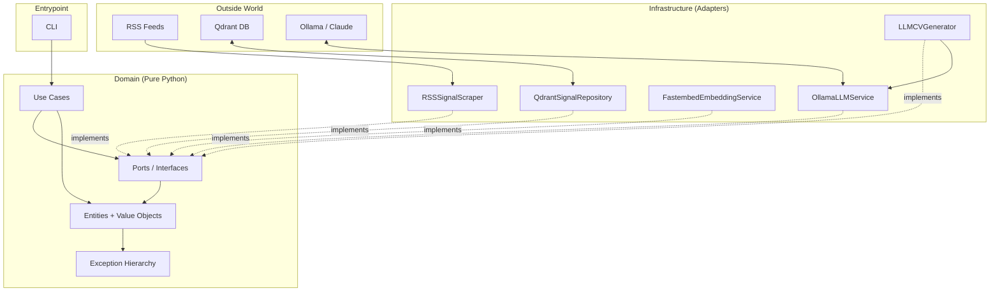

# VenturePulseAI

**Personalized CV generation from real-time startup funding signals.**

A system that scrapes venture funding rounds from RSS feeds, stores them as vectors in Qdrant for semantic search, and generates CVs tailored to specific opportunities — with code-level guardrails against LLM hallucination.


> ⚠️ **Status**: This project is under active development. The domain layer (Phase 0) and port definitions (Phase 1) are complete. Infrastructure adapters (Phase 2) are partially implemented. See [Roadmap](#roadmap) for current progress.

---

## Why this project exists

I built this as a real, end-to-end project to deepen my Python and architectural skills while solving a concrete problem: **finding venture-backed companies that are hiring and applying with a CV adapted to each opportunity**.

The system has two integrated workflows:

1. **Signal collection** — pulls funding announcements from curated tech news sources (TechCrunch venture feed and similar), structures them into entities (`FundingRound`, `JobOffer`), and stores them in a vector database for semantic retrieval.
2. **CV generation** — takes a target signal plus a developer profile and produces a tailored CV, with a domain-level guardrail (`CV.validate_against(profile)`) that verifies the LLM did not hallucinate claims absent from the profile.

The hallucination guardrail is what differentiates this from a typical LLM wrapper: **verification lives in code, not in the prompt**.

---

## What it does

Three CLI commands, designed to be composable:

```bash
# Populate the vector database with fresh funding signals
python -m app.cli collect

# Explore opportunities semantically
python -m app.cli search "fintech b2b Series A 5M-20M"
# → [signal-abc] Acme Corp raised $5M Series A — score 0.87
# → [signal-def] Beta Inc closes $3M seed — score 0.81

# Generate a tailored CV for a specific signal
python -m app.cli apply --signal-id signal-abc --output cv_acme.md
# → CV generated, validated against profile ✓
```

The developer profile is **decoupled from collection and search** — it's only used at CV generation time. This keeps the data layer independent of any single user and makes the system trivially reusable.

---

## Architecture

The project follows **Clean Architecture** / **Hexagonal (Ports & Adapters)**. Dependencies flow inward toward the domain; infrastructure depends on abstractions, never the other way around.



### Key architectural decisions

| Decision | Rationale |
|---|---|
| **Domain has zero external dependencies** | Only Python stdlib. Verified by `grep` in every commit. Tests run in ~0.1s without Docker or network. |
| **Value objects are immutable (`frozen=True`)** | Invariants enforced at construction time. `Money(-1, "USD")` raises immediately, not in business logic. |
| **Ports defined in the domain, not infrastructure** | The domain dictates the contract; adapters comply. Swapping Qdrant for Pinecone is one file change, no domain edits. |
| **Defense in depth** | Entities re-validate values from value objects. Protects against future deserialization paths bypassing the constructor. |
| **Anti-hallucination guardrail in code** | `CV.validate_against(profile)` verifies every claim is grounded in the developer's stated experience. Verification is deterministic, not "trust the prompt". |
| **Async factory pattern for I/O-bound init** | When constructors require network calls (e.g., verifying Qdrant collection dimensions), they expose `await Class.create(...)` instead of mixing sync `__init__` with deferred `initialize()`. |
| **Free + Paid implementation duality** | Every external service has (or will have) both a free local implementation (Ollama, Fastembed local, Qdrant local) and a configuration switch for paid alternatives (Claude API). The MVP runs entirely free. |

ADRs documenting these decisions live in [`docs/architecture/`](docs/architecture/).

---

## Tech stack

| Layer | Technology |
|---|---|
| Language | Python 3.12 |
| Configuration | `pydantic-settings` (typed nested settings, `extra="forbid"`) |
| Vector database | Qdrant (local via Docker) |
| Embeddings | `fastembed` with BGE-small-en-v1.5 (384 dims, ONNX runtime) |
| LLM (free, default) | Ollama running `llama3.1:8b` locally |
| LLM (paid, optional) | Claude API (Anthropic) |
| Scraping | `httpx` + `feedparser` |
| Testing | `pytest` + `pytest-cov`, unit and integration separated by markers |
| Containerization | Docker Compose for Qdrant |

---

## Project structure

```
VenturePulseAI/
├── app/
│   ├── domain/                    # Pure Python, no external dependencies
│   │   ├── entities/              # Signal, FundingRound, JobOffer, DeveloperProfile, CV
│   │   ├── value_objects/         # Money, Embedding, MatchScore, identifiers, enums
│   │   ├── ports/                 # 5 abstract interfaces (ISignalRepository, ...)
│   │   └── exceptions.py          # VenturePulseError taxonomy
│   ├── infrastructure/            # Adapters implementing ports
│   │   ├── config/                # Typed settings (pydantic-settings)
│   │   ├── persistence/           # Qdrant adapter
│   │   ├── embedding/             # Fastembed adapter
│   │   ├── llm/                   # Ollama adapter (Claude planned post-MVP)
│   │   └── scraping/              # RSS adapter
│   ├── application/               # Use cases (planned for Phase 3)
│   └── cli/                       # CLI entrypoint (planned for Phase 3)
├── tests/
│   ├── unit/                      # Fast, no external services (~0.1s for 55 tests)
│   └── integration/               # Real services, marked with @pytest.mark.integration
├── docs/
│   ├── architecture/              # ADRs
│   └── phases/                    # Phase-by-phase learning documents
├── docker-compose.yaml
└── requirements.txt
```

---

## Roadmap

The project is structured in four phases, each with a closing learning document and full test coverage of what was built.

| Phase | Scope | Status |
|---|---|---|
| **Phase 0 — Domain** | Entities, value objects, exception hierarchy, 55 unit tests, 100% coverage | ✅ Complete |
| **Phase 1 — Ports** | 5 abstract interfaces with their DTOs, async generator pattern for `fetch` | ✅ Complete |
| **Phase 2 — Infrastructure adapters** | Config, embeddings, vector repo, LLM, scraping, CV generator | 🟡 In progress (3 of 6) |
| **Phase 3 — Use cases + CLI** | `collect`, `search`, `apply` commands wired end-to-end | ⏳ Planned |
| **Phase 4 — Hardening** | Logging, retries, observability minimal for MVP demo | ⏳ Planned |

**Out of scope for MVP** (deferred to a post-MVP backlog):

- Job offer scraping (only funding rounds in MVP — the `JobOffer` entity already exists in the domain for future expansion)
- Web UI (CLI is sufficient for the MVP)
- Automatic profile-based matching (manual `search` queries work for now)
- Caching, observability, advanced retries

---

## Quick start

> Some sections below depend on Phase 3 (CLI) being complete. They are documented now to make the intended UX explicit.

### Prerequisites

- Python 3.12+
- Docker + Docker Compose
- [Ollama](https://ollama.com) installed locally with `llama3.1:8b` pulled

### Setup

```bash
# Clone and enter
git clone https://github.com/SebastianTorreiro/VenturePulseAI.git
cd VenturePulseAI

# Python environment
python -m venv .venv
source .venv/bin/activate  # On Windows: .venv\Scripts\activate
pip install -r requirements.txt

# Configure
cp .env.example .env
# Edit .env if you want to change defaults (Ollama model, Qdrant URL, etc.)

# Start Qdrant
docker compose up -d qdrant

# Pull the Ollama model (only once)
ollama pull llama3.1:8b
```

### Running

```bash
# Phase 3+ — not yet wired:
python -m app.cli collect
python -m app.cli search "your query"
python -m app.cli apply --signal-id <id>
```

---

## Testing

```bash
# Unit tests — fast, no external services required
pytest tests/unit/ -q

# Integration tests — require Qdrant and Ollama running
pytest tests/integration/ -m integration -v

# Coverage on the domain layer
pytest tests/unit/domain/ --cov=app/domain --cov-report=term-missing
```

The domain layer maintains **100% coverage** as a hard rule.

---

## Development log

Each phase closes with a structured PDF documenting what was built, the rationale, and the lessons learned. These serve as:

- An onboarding aid for anyone reading the code
- A study reference for the architectural patterns applied
- Honest documentation of trade-offs and deferred decisions

See [`docs/phases/`](docs/phases/):

- `Phase0_VenturePulseAI.pdf` — Domain layer, value objects, exception taxonomy
- `Phase1_VenturePulseAI.pdf` — Ports, the async generator pattern, dependency inversion
- (Phase 2 and 3 documents will be added as each phase closes)

---

## About the author

Built by [Sebastián Torreiro](https://github.com/SebastianTorreiro) as a deliberate learning project — using AI-assisted development with explicit pedagogical discipline (every architectural choice is verified, justified, and documented before moving on).

If you are a recruiter and want to discuss the design choices in depth, the development logs above provide more context than the code alone.

---

## License

MIT. See [LICENSE](LICENSE) for details.
