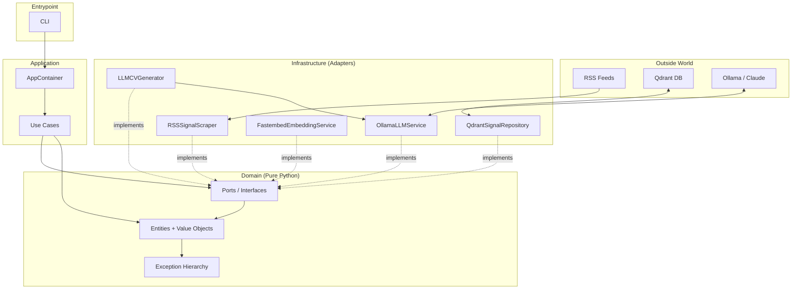

# VenturePulseAI

**Personalized CV generation from real-time startup funding signals.**

A system that scrapes venture funding rounds from RSS feeds, stores them as vectors in Qdrant for semantic search, and generates CVs tailored to specific opportunities — with code-level guardrails against LLM hallucination.


-success)


> **Status**: The MVP is complete. All four core phases (domain, ports, infrastructure adapters, use cases + CLI) are implemented and merged. The three CLI commands run end-to-end against real services. See [Roadmap](#roadmap) for what's done and what's deferred to the post-MVP backlog.

---

## Why this project exists

I built this as a real, end-to-end project to deepen my Python and architectural skills while solving a concrete problem: **finding venture-backed companies that are hiring and applying with a CV adapted to each opportunity**.

The system has two integrated workflows:

1. **Signal collection** — pulls funding announcements from curated tech news sources (TechCrunch venture feed and similar), structures them into entities (`FundingRound`, `JobOffer`), and stores them in a vector database for semantic retrieval.
2. **CV generation** — takes a target signal plus a developer profile and produces a tailored CV, with a domain-level guardrail (`CV.validate_against(profile)`) that verifies the LLM did not hallucinate claims absent from the profile.

The hallucination guardrail is what differentiates this from a typical LLM wrapper: **verification lives in code, not in the prompt**.

---

## What it does

Three CLI commands, designed to be composable:

```bash
# Populate the vector database with fresh funding signals
python -m app.cli collect --days 30

# Explore opportunities semantically
python -m app.cli search "fintech b2b automation"
# → [0a66b7e3] Orbio raised $21M — score 0.61
# → [ceaf007d] Benchmark closes $2B fund — score 0.53

# Generate a tailored CV for a specific signal
python -m app.cli apply <signal-id> --output cv_acme.md
# → CV generated, validated against profile ✓
```

The developer profile is **decoupled from collection and search** — it's only used at CV generation time. This keeps the data layer independent of any single user and makes the system trivially reusable.

### A note on the anti-hallucination guardrail

When you run `apply`, the generated CV is validated against the developer profile before being written to disk. If the LLM produces claims that aren't grounded in the profile, generation is retried (up to 3 times) and then fails cleanly with a `CVHallucinationError` rather than producing an unverified CV.

The current validator uses substring matching, which is intentionally strict: it rejects legitimate paraphrasing as well as actual hallucination. This is a documented trade-off (see [Roadmap](#roadmap)) — the system prefers refusing to generate over silently producing something unverifiable. An upgrade to LLM-based validation is on the post-MVP backlog.

---

## Architecture

The project follows **Clean Architecture** / **Hexagonal (Ports & Adapters)**. Dependencies flow inward toward the domain; infrastructure depends on abstractions, never the other way around.



### Key architectural decisions

| Decision | Rationale |
|---|---|
| **Domain has zero external dependencies** | Only Python stdlib. Verified by `grep` in every commit. Tests run in ~0.6s without Docker or network. |
| **Value objects are immutable (`frozen=True`)** | Invariants enforced at construction time. `Money(-1, "USD")` raises immediately, not in business logic. |
| **Ports defined in the domain, not infrastructure** | The domain dictates the contract; adapters comply. Swapping Qdrant for Pinecone is one file change, no domain edits. |
| **Composition root** | `AppContainer` (`app/infrastructure/config/container.py`) is the single place where concrete adapters are named. Everything else sees only interfaces. |
| **Async factory pattern for I/O-bound init** | When constructors require network calls (e.g., verifying Qdrant collection dimensions), they expose `await Class.create(...)` instead of mixing sync `__init__` with deferred `initialize()`. |
| **Sentinel value over nullable schema** | The LLM extraction schema forces `amount_usd` to be a number (0 = "not found") rather than allowing `null`, which an 8B model picks too readily. Schema strict beats hopeful prompt. |
| **Probe-based dimension detection** | The embedding service measures its own output dimensions empirically rather than reading library metadata that can change between versions. |
| **Anti-hallucination guardrail in code** | `CV.validate_against(profile)` verifies every claim is grounded in the developer's stated experience. Verification is deterministic, not "trust the prompt". |
| **Single `asyncio.run` per CLI command** | Async clients (Qdrant, Ollama) are bound to the event loop that created them. Each command groups construction + execution in one coroutine under a single `asyncio.run`. |
| **Fakes over mocks in tests** | Use-case tests use real classes implementing the ports. A signature change breaks a fake with a type error; a mock silently returns another mock. |
| **Free + paid implementation duality** | Every external service runs free and local (Ollama, Fastembed, Qdrant) with a configuration switch reserved for paid alternatives (Claude API). The MVP runs entirely free. |

ADRs documenting these decisions live in [`docs/architecture/`](docs/architecture/).

---

## Tech stack

| Layer | Technology |
|---|---|
| Language | Python 3.12 |
| Configuration | `pydantic-settings` (typed nested settings, `extra="forbid"`) |
| Vector database | Qdrant (local via Docker) |
| Embeddings | `fastembed` with BGE-small-en-v1.5 (384 dims, ONNX runtime) |
| LLM (free, default) | Ollama running `llama3.1:8b` locally |
| LLM (paid, optional) | Claude API (Anthropic) — configuration reserved, adapter post-MVP |
| Scraping | `httpx` + `feedparser` |
| CLI | `typer` |
| Testing | `pytest` + `pytest-cov`, unit and integration separated by markers |
| Containerization | Docker Compose for Qdrant |

---

## Project structure

```
VenturePulseAI/
├── app/
│   ├── domain/                    # Pure Python, no external dependencies
│   │   ├── entities/              # Signal, FundingRound, JobOffer, DeveloperProfile, CV
│   │   ├── value_objects/         # Money, Embedding, MatchScore, identifiers, enums
│   │   ├── ports/                 # 5 abstract interfaces (ISignalRepository, ...)
│   │   └── exceptions.py          # VenturePulseError taxonomy
│   ├── infrastructure/            # Adapters implementing ports
│   │   ├── config/                # Typed settings + AppContainer (composition root)
│   │   ├── persistence/           # Qdrant adapter
│   │   ├── embedding/             # Fastembed adapter
│   │   ├── llm/                   # Ollama adapter + CV generator (Claude planned post-MVP)
│   │   └── scraping/              # RSS adapter
│   ├── application/               # Use cases: ingest, search, generate CV
│   ├── cli.py                     # CLI commands: collect / search / apply
│   └── __main__.py                # python -m app.cli entrypoint
├── tests/
│   ├── unit/                      # Fast, no external services (~0.6s for 66 tests)
│   └── integration/               # Real services, marked with @pytest.mark.integration
├── docs/
│   ├── architecture/              # ADRs
│   └── phases/                    # Phase-by-phase learning documents
├── docker-compose.yaml
└── requirements.txt
```

---

## Roadmap

The project was built in four phases, each closed with a learning document and full test coverage of what was built.

| Phase | Scope | Status |
|---|---|---|
| **Phase 0 — Domain** | Entities, value objects, exception hierarchy, 55 unit tests, 100% coverage | ✅ Complete |
| **Phase 1 — Ports** | 5 abstract interfaces with their DTOs, async generator pattern for `fetch` | ✅ Complete |
| **Phase 2 — Infrastructure adapters** | Config, embeddings, vector repo, LLM, scraping, CV generator (6 of 6) | ✅ Complete |
| **Phase 3 — Use cases + CLI** | `collect`, `search`, `apply` wired end-to-end via composition root | ✅ Complete |

**MVP demo (real run against live services):**

- `collect --days 30` → 17 signals scraped, 2 ingested, 14 skipped (no extractable entities), 1 error. The low ingest rate reflects the quality ceiling of `llama3.1:8b` against unstructured news text, not an architectural issue — swapping to a larger model is a config change.
- `search "fintech b2b automation"` → 3 semantically ranked results with correct amounts. Vector search works as intended.
- `apply <id>` → generates and validates a CV; rejects unverifiable output cleanly via the guardrail.

**Deferred to the post-MVP backlog:**

- **LLM-based hallucination validator** — replace substring matching with semantic verification, removing the 2 documented test skips and improving the valid-CV rate.
- **Job offer scraping** — a second scraper (Remotive, Wellfound). The `JobOffer` entity already exists in the domain.
- **Claude LLM adapter** — `ClaudeLLMService` implementing `ILLMService`, selectable via settings.
- **Larger extraction model** — `llama3.3` or Claude for a higher entity-extraction rate against real news text.
- **Web UI** — the CLI is sufficient for the MVP.
- **Automatic profile-based matching, caching, advanced retries, observability.**

---

## Quick start

### Prerequisites

- Python 3.12+
- Docker + Docker Compose
- [Ollama](https://ollama.com) installed locally with `llama3.1:8b` pulled

### Setup

```bash
# Clone and enter
git clone https://github.com/SebastianTorreiro/VenturePulseAI.git
cd VenturePulseAI

# Python environment
python -m venv .venv
source .venv/bin/activate  # On Windows: .venv\Scripts\activate
pip install -r requirements.txt

# Configure
cp .env.example .env
# Edit .env if you want to change defaults (Ollama model, Qdrant URL, etc.)

# Start Qdrant
docker compose up -d qdrant

# Pull the Ollama model (only once)
ollama pull llama3.1:8b
```

### Running

```bash
# Collect funding signals from the last N days
python -m app.cli collect --days 30

# Search opportunities semantically
python -m app.cli search "your query here"

# Generate a tailored CV for a signal (requires a developer profile)
python -m app.cli apply <signal-id> --output cv.md
```

### Configuring your developer profile

CV generation reads a developer profile (YAML). Copy the example and fill it in with your own experience:

```bash
cp profile/developer_profile.example.yaml profile/developer_profile.yaml
# Edit with your real achievements, written as concrete, atomic statements
```

> **Tip:** because the current validator uses substring matching, write achievements the way you want them to appear in the CV. The closer the profile wording is to natural CV phrasing, the higher the first-attempt success rate.

---

## Testing

```bash
# Unit tests — fast, no external services required
pytest tests/unit/ -q

# Integration tests — require Qdrant and Ollama running
pytest tests/integration/ -m integration -v

# Coverage on the domain layer
pytest tests/unit/domain/ --cov=app/domain --cov-report=term-missing
```

**Current test suite:**

- 66 unit tests (55 domain + 11 use cases) in ~0.6s, no external services
- 89 integration tests (87 passed, 2 skipped — documented validator limitation)
- The domain layer maintains **100% coverage** as a hard rule

---

## Development log

Each phase closes with a structured PDF documenting what was built, the rationale, and the lessons learned. These serve as:

- An onboarding aid for anyone reading the code
- A study reference for the architectural patterns applied
- Honest documentation of trade-offs and deferred decisions

See [`docs/phases/`](docs/phases/):

- `Phase0_VenturePulseAI.pdf` — Domain layer, value objects, exception taxonomy
- `Phase1_VenturePulseAI.pdf` — Ports, the async generator pattern, dependency inversion
- `Phase2_VenturePulseAI.pdf` — The six infrastructure adapters and LLM-in-production lessons
- `Phase3_VenturePulseAI.pdf` — Use cases, composition root, CLI, and the end-to-end demo

Thematic deep-dives (design patterns, testing strategy, architecture, LLMs in production, Python for JS developers) are also available as standalone documents.

---

## About the author

Built by [Sebastián Torreiro](https://github.com/SebastianTorreiro) as a deliberate learning project — using AI-assisted development with explicit pedagogical discipline (every architectural choice is verified, justified, and documented before moving on).

If you are a recruiter and want to discuss the design choices in depth, the development logs above provide more context than the code alone.

---

## License

MIT. See [LICENSE](LICENSE) for details.
